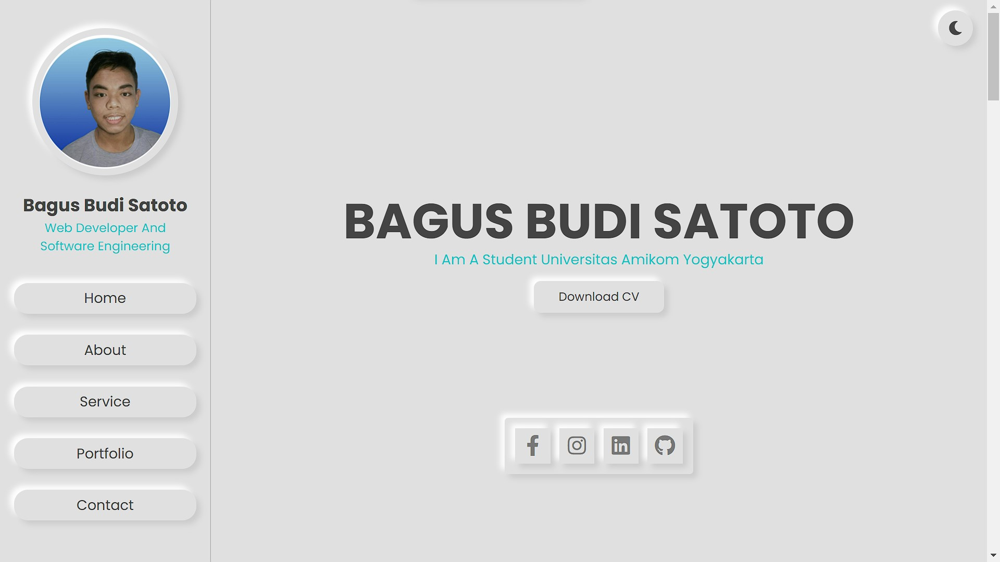

<h1 align="center">My Portofolio</h1>


<!-- Garis Lurus -->
 
<!-- End -->


<br>


<!-- Garis Lurus -->
 
<!-- End -->

## 📌 About
> Portofolio ini dibuat menggunakan bahasa pemprograman HTML, CSS, and JavaScript. Berguna untuk public website portfolio.


<!-- Garis Lurus -->
 
<!-- End -->

## 🗃️ Langueges and Tools
- [HTML](https://developer.mozilla.org/en-US/docs/Web/HTML)
- [Css](https://developer.mozilla.org/en-US/docs/Web/CSS)
- [JavaScript](https://developer.mozilla.org/en-US/docs/Web/JavaScript)


<!-- Garis Lurus -->
 
<!-- End -->

## 👦🏽 Siapa pembuat aplikasi ini?

| Profile        |  Keterangan                      |
|----------------|----------------------------------|
| Nama           | Bagus Budi Satoto                |
| Jurusan        | S1 - Informatika                 |
| Kampus         | Universitas Amikom Yogyakarta    |

<!-- Garis Lurus -->
 
<!-- End -->

## 🔗 Cara Install
<br>

- <code>git clone ↆↆ </code>
  
  ```bash
  git clone https://github.com/bagussatoto/My-Portofolio.git
  ``` 
  
- <code>cd pusat karir</code>
    
    ```bash
    cd My-Portofolio
    ```
- <code>npm install</code>
    
    ```bash
    npm install
    ```
<!-- Garis Lurus -->
 
<!-- End -->


## 📌 Request Fitur Baru dan Pelaporan Bug

Anda dapat meminta fitur baru maupun melaporkan bug melalui menu **issues** yang sudah disediakan oleh GitHub (lihat menu di atas), posting issues baru dan kita akan berdiskusi disana.

## 🛒 Berkontribusi

Siapapun dapat berkontribusi pada proyek ini mulai dari pemrograman, pembuakan buku manual, sampai dengan mengenalkan produk ini kepada Mahasiswa 
Untuk belajar agar mengurangi kesenjangan pendidikan teknologi dengan cara membuat postingan issue di repository ini.


> 🧑🏽‍💻 | [BAGUS BUDI SATOTO ](http://github.com/bagussatoto)
<br>
 